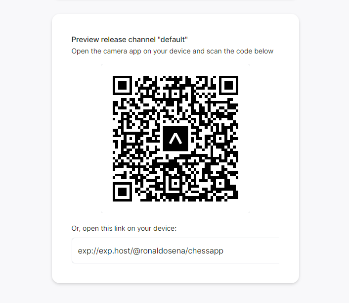

<div id="top"></div>

<!-- PROJECT LOGO -->
<br />
<div align="center">
  <a href="https://github.com/ronaldosena/chessapp/commits/">
    
  </a>

  <h3 align="center">Chess app</h3>

  <p align="center">
    An ongoing attempt to create my own chess app (just for fun =)
    <br />
    <a href="https://github.com/ronaldosena/chessapp/commits/"><strong>Explore the code »</strong></a>
    <br />
    <br />
    <a href="https://github.com/ronaldosena/chessapp/assets/qrcode_expo.png">View Demo</a>
    ·
    <a href="https://github.com/ronaldosena/chessapp/issues">Report Bug</a>
    ·
    <a href="https://github.com/ronaldosena/chessapp/LICENSE.md">View License</a>
  </p>
</div>

## About The Project

[![Chess app][demo-gif]](https://example.com)

This is an ongoing project to create my own chess app, with some of my favorite feature from popular chess websites and apps.
The basic functionalities are working, but there is a lot of work to be done!

### Built With

- [React Native](https://reactnative.dev/)
- [Expo](https://docs.expo.dev/)

## Getting Started

### Prerequisites

This is a list of things you need to run the project:

- Expo

```sh
  follow the get-started at https://docs.expo.dev/get-started/installation/
```

### Installation & Usage

1. Clone the repo
   ```sh
   git clone https://github.com/ronaldosena/chessapp.git
   ```
2. Install dependencies
   ```sh
   yarn
   ```
3. Run expo (locally or in device)
   ```sh
   yarn start
   ```

## Roadmap

- [x] Project kick-off
- [ ] Fix promotion bug
- [ ] Highlight allowed moves
- [ ] Add time control

<!-- CONTRIBUTING -->

## Contributing

Contributions are what make the open source community such an amazing place to learn, inspire, and create. Any contributions you make are **greatly appreciated**.

If you have a suggestion that would make this better, please fork the repo and create a pull request. You can also simply open an issue with the tag "enhancement".
Don't forget to give the project a star! Thanks again!

1. Fork the Project
2. Create your Feature Branch (`git checkout -b feature/AmazingFeature`)
3. Commit your Changes (`git commit -m 'Add some AmazingFeature'`)
4. Push to the Branch (`git push origin feature/AmazingFeature`)
5. Open a Pull Request

<!-- LICENSE -->

## License

Distributed under the Coffeware License. See [`LICENSE.md`](https://github.com/ronaldosena/chessapp/LICENSE.md) for more information.

<!-- CONTACT -->

## Contact

You can reach me out at [@roronalds\_](https://twitter.com/roronalds_) or send an e-mail to ronaldo.sena@outlook.com

<p align="right"><a href="#top">back to top</a></p>

<!-- MARKDOWN LINKS & IMAGES -->

[demo-gif]: assets/qrcode_expo.png
